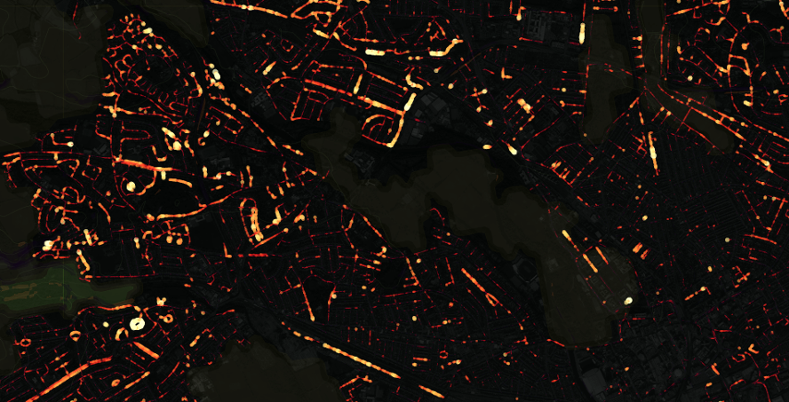
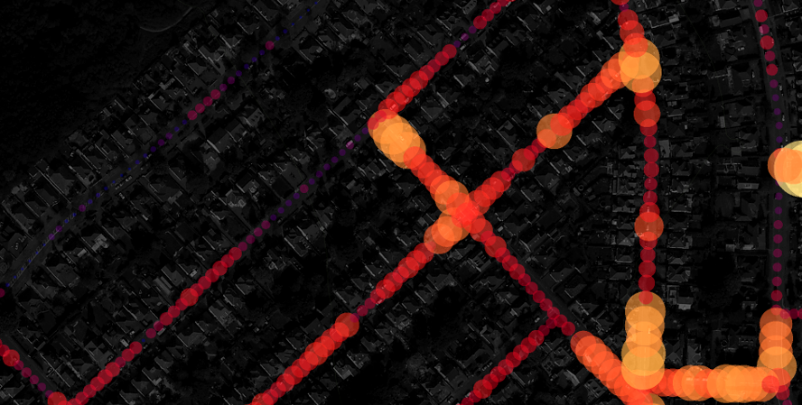
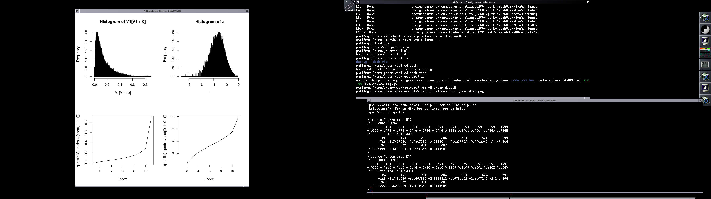

# Green streets visualisation

This visualisation is based on Uber's [deck.gl](http://deck.gl).





## Running

Get a developer [api token](https://www.mapbox.com/help/how-access-tokens-work/) 
from [mapbox](https://www.mapbox.com/).

To run it, install `nodejs`, then:

```bash
npm install
export MapboxAccessToken="MY_SECRET_TOKEN"
npm start
```

The code is mainly based on the 
[GeoJsonLayer](https://github.com/uber/deck.gl/blob/master/docs/layers/geojson-layer.md)
example in the deck.gl docs.

## Notes

The heatmap colour scheme has been scaled to match the quantiles of the green 
distribution for streets in Manchester. 
[chroma.js](https://github.com/gka/chroma.js/) has been used for colour 
manipulation.



