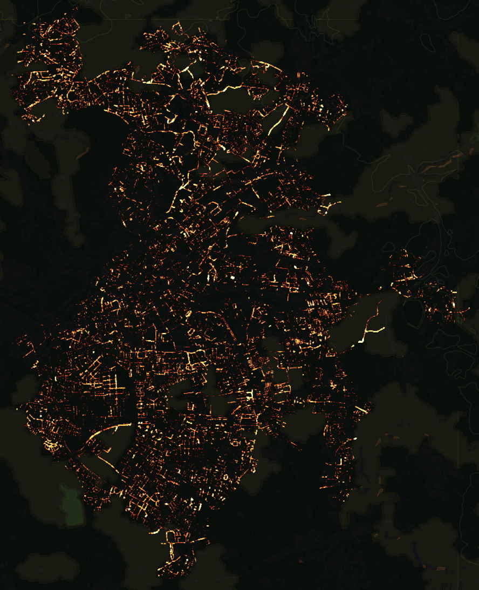
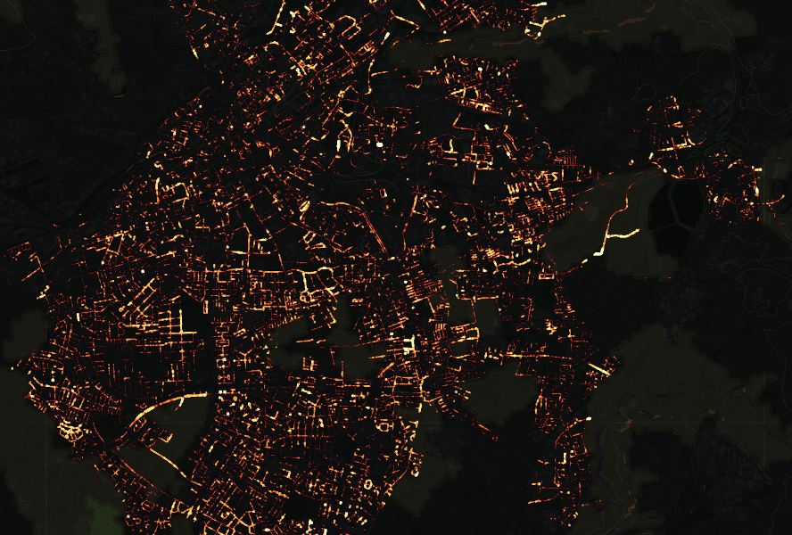
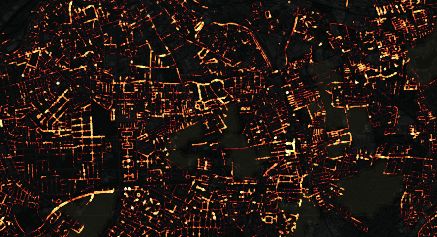
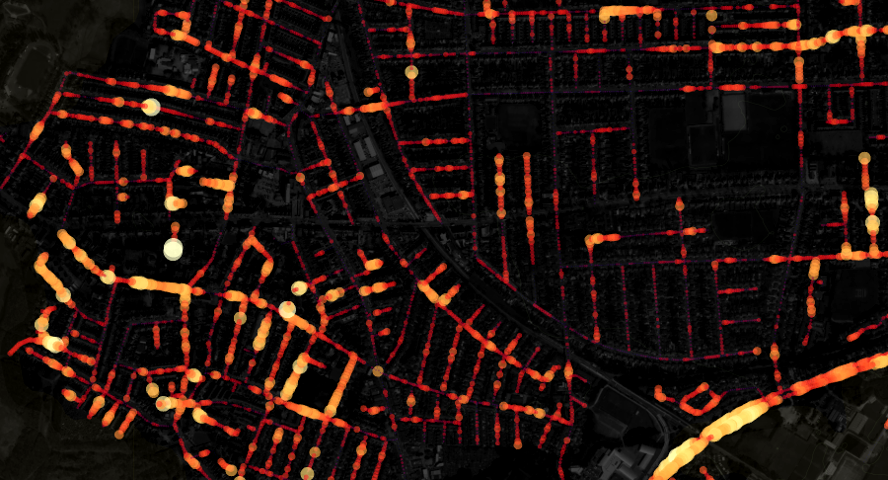
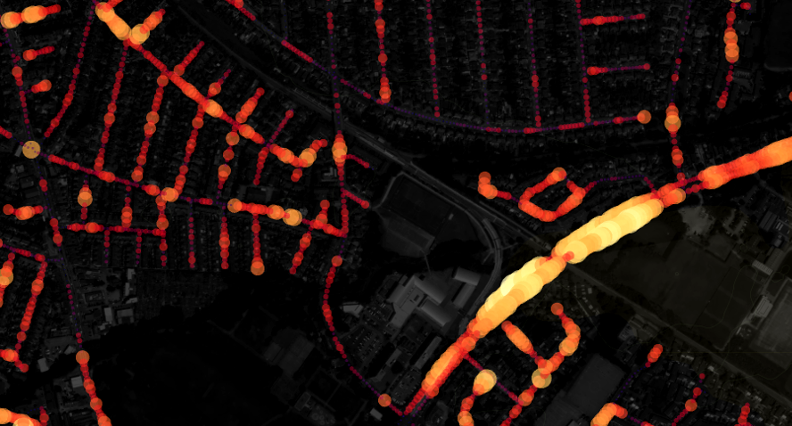

# Green streets visualisation

[](http://www.repostatus.org/#inactive)
[](http://www.nationalarchives.gov.uk/doc/open-government-licence/version/3/)

This visualisation is based on Uber's [deck.gl](http://deck.gl).







## Running

Get a developer [api token](https://www.mapbox.com/help/how-access-tokens-work/) 
from [mapbox](https://www.mapbox.com/).

To run it, install `nodejs`, then:

```bash
cd data
wget https://github.com/datasciencecampus/street-view-pipeline/raw/master/data/cardiff_segments.zip
unzip cardiff_segments.zip ;cd .. 

npm install
export MapboxAccessToken="MY_SECRET_TOKEN"
npm start
```

The code is mainly based on the 
[GeoJsonLayer](https://github.com/uber/deck.gl/blob/master/docs/layers/geojson-layer.md)
example in the deck.gl docs.
