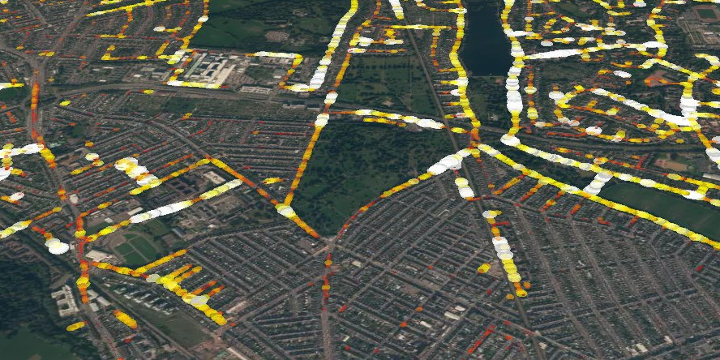

# Urban vegetation visualisation (demo) 

[](http://www.repostatus.org/#inactive)
[](http://www.nationalarchives.gov.uk/doc/open-government-licence/version/3/)

> Based on Uber's [deck.gl](http://deck.gl).



## Running

Get a developer [api token](https://www.mapbox.com/help/how-access-tokens-work/) 
from [mapbox](https://www.mapbox.com/).

To run, install `nodejs`, then:

1. Get sample data for Cardiff from our [street-view-pipeline](https://github.com/datasciencecampus/street-view-pipeline)

```bash
cd data
./download.sh
cd -
```

2. Install dependencies

```bash
npm install
```

3. Run

```bash
export MapboxAccessToken="MY_SECRET_TOKEN"
npm start
```

4. Building

```bash
npm run build
```

The code is mainly based on the 
[GeoJsonLayer](https://github.com/uber/deck.gl/blob/master/docs/layers/geojson-layer.md)
example in the deck.gl docs.
